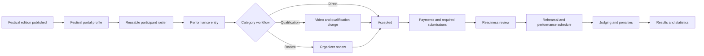

# Ladna Festival Framework

This document preserves the product investigation and implementation decisions behind Ladna's standalone Festival domain. It intentionally contains no Telegram credentials, signed links, payment details, or personal participant data.

## Investigation coverage

The EvolutionUA Telegram bot conversation available to the configured Slastya account was reviewed from its first recorded interaction in July 2025. The current Telegram Mini App was also inspected on the connected Android device without changing the external account: no profile was saved, participant created, application submitted, file uploaded, notification preference changed, payment started, or organizer contacted.

### Observed behavior

Directly observed behavior includes:

- a calendar of upcoming and completed competitions;
- a coach, guardian, or adult-athlete profile gate;
- a reusable participant roster with date of birth;
- event information, regulations, organizer contacts, documents, payment instructions, music restrictions, categories, stages, tickets, and optional media services;
- public rankings and participant-specific per-judge scorecards;
- statistics grouped by direction and entry format;
- legacy conversational registration, qualification, payment-proof, music, waiver, insurance, schedule, reminder, and organizer-message flows.

### Inferred behavior

The current profile-gated registration submission and the organizer back office were not mutated or directly inspected. Their responsibilities are inferred from the complete historical conversation and the public/completed Mini App surfaces.

## Product conclusion

EvolutionUA is a competition-operations product rather than ordinary event ticketing. The central record is a performance entry containing one or more participants. Category selection, qualification, requirements, fees, music, scheduling, judging, and results belong to that entry.

## Fixed boundaries

- Festival data is owned by one Ladna `Account`.
- Festival portal identities and participants are separate from `Customer`. There is no foreign key, optional link, lookup, synchronization, merge, or fallback.
- Festivals are separate from `Event`. There is no foreign key, migration, shared aggregate, or Event lifecycle change.
- Existing Ladna `User` records administer Festivals. Invited guest judges and registrants use the Festival-only guard.
- Generic payment gateway infrastructure and secure QR design patterns may be reused through Festival-specific actions and records.
- Telegram bot and Mini App delivery are deferred. Domain actions remain channel-neutral and a future Telegram identity will attach to an existing account-scoped Festival portal identity.

## Domain glossary

- **Festival series**: reusable brand and organizer defaults.
- **Festival edition**: one dated, independently frozen competition.
- **Festival portal user**: account-scoped coach, guardian, adult athlete, or invited judge authenticated by email magic link.
- **Participant**: reusable roster identity owned by one Festival portal user.
- **Entry**: one solo, duo, group, or crew performance submitted to an edition.
- **Category**: an allowed combination of classification options and typed eligibility/workflow rules.
- **Requirement**: a category- and stage-aware obligation such as music, video, waiver, insurance, backdrop, or payment proof.
- **Charge**: a snapshotted qualification, participation, late, or custom amount owed for an entry.
- **Admission**: spectator inventory and tickets, separate from participation charges.
- **Readiness**: a derived result requiring accepted review, satisfied qualification, paid charges, accepted submissions, and a performance slot.

## Independent state machines

- Edition: draft, published, in progress, completed, cancelled, archived.
- Registration: closed, open, paused, plus scheduled opening and closing timestamps.
- Entry review: draft, submitted, under review, accepted, rejected, withdrawn.
- Qualification: not required, pending, passed, failed.
- Requirement: missing, submitted, accepted, rejected, waived.
- Charge/payment: pending, paid, failed, cancelled, refunded, refund required.
- Score sheet: draft, submitted, locked/unlocked with an audit reason.
- Admission ticket: valid, voided, refunded, checked in/out with immutable scan history.

## SaaS tariff packages and prepaid editions

- `accounts.enable_festivals` remains a platform-controlled, default-disabled rollout capability. Package rows never expose the module by themselves.
- Festival SaaS pricing is a one-time add-on owned by `SubscriptionPlan`; it is independent from recurring `SubscriptionPriceVersion` location tiers.
- Every newly created edition consumes exactly one available `FestivalEditionPurchase`. Only an account owner may initiate a purchase, while staff with Festival management permission may redeem an available purchase.
- A zero-price package creates an available entitlement without a gateway payment, subscription payment, or fiscal receipt. Paid purchases use Ladna's platform Monopay integration, preferring an active tokenized SaaS card and otherwise using hosted one-time checkout.
- Purchases preserve immutable tariff name, package name, amount, currency, participant limit, and ticket limit snapshots. Later tariff/package changes do not alter a purchase or edition.
- Participant capacity counts distinct Festival participant IDs across submitted, under-review, and accepted entries. Draft, rejected, and withdrawn entries do not consume capacity; one participant in several active performances counts once.
- Ticket capacity counts paid orders and unexpired pending holds across all admission types, including free tickets. Admission inventory and checkout are both constrained by the snapshotted edition limit.
- A payment reversal invalidates an unused entitlement. After redemption it preserves the edition and makes all edition mutation routes read-only pending platform resolution.
- Festival purchases, entrant charges, admission orders, Customers, and Events are separate aggregates.

## Administration shell and public links

The account-level Festival hub stays inside the standard Ladna studio interface. It has two independently paginated views: image cards for Festival editions and a compact editable Festival-series listing. Event and Festival links sit in a separate Events section near the bottom of the studio sidebar because they are not daily studio operations.

Admin routes bind Festival editions and Series by numeric ID. Public and portal routes continue to use readable, account-scoped slugs generated by Ladna; no form exposes a manual public-address field. An edition slug may regenerate while its persisted lifecycle state is draft, including a title change saved together with publication. After the edition leaves draft, its public slug remains stable. A Series slug is generated once and remains stable.

Each Festival card may use one uploaded JPEG, PNG, or WebP cover stored as Festival media, with a branded accessible fallback when no cover exists. Replacing a managed cover stores the new asset first and removes the old file only after the database update succeeds.

Entering one exact edition changes the complete left sidebar to a fixed midnight-and-gold Festival operations theme. The sidebar shows a clear Festival identity, links back to the Festival hub and studio, and groups seven server-rendered permission-scoped workflows by purpose rather than placing them in a horizontal tab strip:

- Overview contains permission-safe state and action counts without entrant contact details or revenue.
- Applications owns entry, qualification, requirement-file, and entry-payment review.
- Program owns stages, rehearsals, performances, and audited rescheduling.
- Judging and results owns assignments, frozen rubrics, score sheets, and publication.
- Tickets and entrance owns spectator inventory, admission orders, tickets, and the focused scanner subpage.
- Communication owns announcements, account-wide Festival notification scenarios, and outbox state.
- Settings owns edition taxonomy, requirements, entry charges, and public content.

Every workflow has a dedicated refreshable URL and loads only the data it renders. Sidebar visibility never replaces controller authorization. Mixed-permission workflows also suppress unauthorized data: Festival finance is required for revenue and entry-payment details, registration management is required for applicant contact data and private submissions, and staff judges require an active edition assignment. Judge-only users also see only assigned editions on the hub.

## Delivery checklist

- [x] Phase 1 — Foundation: account capability, permissions, series/edition configuration, public calendar and information page.
- [x] Phase 2 — Festival portal: magic-link guard, profile, participant roster, portal calendar.
- [x] Phase 3 — Applications: classifications, categories, typed rules, entries, requirements, private submissions, review, charges, online/manual payments.
- [x] Phase 4 — Operations: stages, scheduling, readiness, announcements, notification outbox.
- [x] Phase 5 — Judging: assignments, rubrics, score sheets, penalties, results, statistics.
- [x] Phase 6 — Admission: inventory, checkout, ticket delivery, QR resolution, scanning, reporting.
- [x] Detached staff workspace — paginated card/Series hub, automatic public links, numeric admin routes, hero covers, fixed Festival theme, and grouped permission-aware left navigation.
- [x] SaaS integration — per-tariff Festival packages, owner-only prepaid entitlements, tokenized/hosted payment, immutable snapshots, transactional participant/ticket quotas, and reversal read-only protection.
- [x] Verification: tenant isolation, Customer/Event separation, focused and full tests, build, desktop/mobile browser QA.

## Verification record

The initial standalone implementation was verified on 9 August 2026:

- all six forward-only Festival migrations completed against both the dedicated test database and local development database;
- the focused Festival, API documentation, help, and account-wide page suites passed with 72 tests and 1,862 assertions;
- the unchanged Event regression suites passed with 23 tests and 155 assertions;
- the complete Ladna suite passed with 1,382 tests and 13,695 assertions;
- Pint, Blade compilation, route discovery, translation parity, diff whitespace checks, and the production Vite build passed;
- authenticated desktop, public desktop, and public mobile Playwright checks passed with no browser errors;
- the account capability remains disabled by default; it was enabled only for the local synthetic QA fixture after migrations, tests, and build completed.

The detached administration workspace update was verified on 9 August 2026:

- the focused Festival, help, tenancy, and account-wide page suites passed with 79 tests and 1,949 assertions;
- the unchanged Event regression suites passed with 23 tests and 155 assertions;
- the final isolated Ladna suite passed with 1,392 tests and 13,936 assertions;
- Pint, Blade compilation, route discovery, diff whitespace checks, and the production Vite build passed;
- authenticated desktop and mobile checks covered the Festival hub, Series listing, edition theme, grouped sidebar, numeric admin URL, and mobile drawer without browser, request, or HTTP 500 errors.

The prepaid Festival SaaS integration was verified on 9 August 2026:

- the separate schema and initial-package migrations completed against the dedicated test database and the local development database;
- the focused Festival SaaS billing and help suites passed with 53 tests and 893 assertions;
- the final isolated Ladna suite passed with 1,405 tests and 14,014 assertions;
- Pint, Blade compilation, translation-key parity, diff whitespace checks, and the production Vite build passed;
- authenticated platform-admin and studio-owner desktop/mobile checks covered the S/M/L tariff matrix, zero-price input, account capability control, package selection, quota presentation, and removal of direct edition creation;
- rendered QA had no application exceptions or HTTP failures. Headless Chromium reported only local-certificate fetch warnings for optional external scripts.

Update this checklist and the affected behavior sections with every Festival release.
